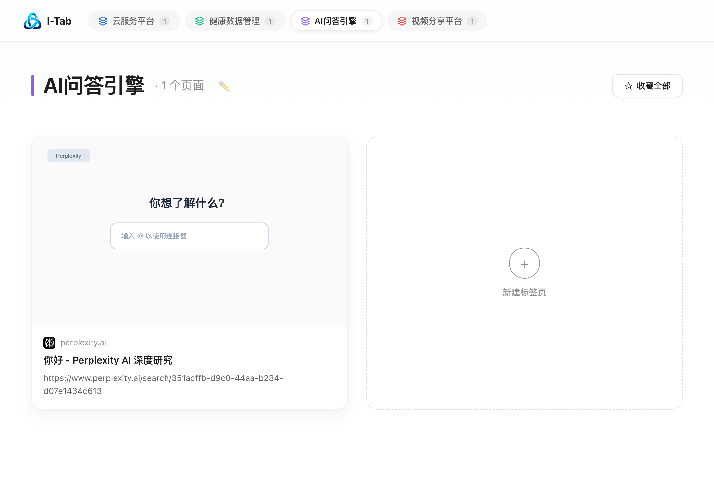
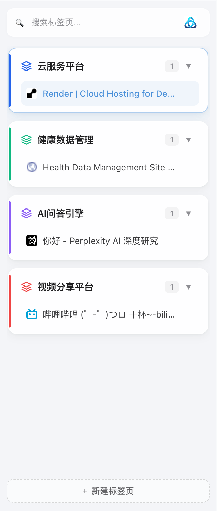

<p align="center">
  
</p>

<h1 align="center">I-Tab</h1>

<p align="center">
  <strong>新一代大模型语义驱动的 Chrome 标签页智能工作区 · 告别杂乱顶栏，拥抱毫秒级优雅收纳</strong><br>
  <em>A Modern, Glassmorphic Chrome Tab Workspace Powered by LLMs with Zero Top-Bar Pollution</em>
</p>

<p align="center">
  
  
  
  
  
</p>

<p align="center">
  <a href="#-中文说明"><strong>简体中文</strong></a> •
  <a href="#-english-readme"><strong>English</strong></a>
</p>

---

<br>

# 🇨🇳 中文说明

## 💡 为什么创造 I-Tab？

当我们日常浏览积累了 30+ 甚至上百个标签页时，传统的标签整理方案往往面临几大痛点：
1. **Chrome 原生分组臃肿丑陋**：在顶部标签栏硬塞一堆彩色胶囊和折叠块，挤占宝贵的标签标题可视区域，顶栏变得极其混乱。
2. **传统规则整理死板生硬**：按域名或 URL 硬性匹配，无法理解当前标签的真实任务与工作场景。
3. **AI 整理响应极慢**：不少 AI 插件默认调用思考模型（Chain of Thought），每次整理需要痛苦等待 15~30 秒，且分类名称冗长抽象。
4. **视觉简陋与频繁裂图**：缺乏现代美学设计，遇到防盗链或跨域 Favicon 时满屏浏览器原生裂图 `🖼️`。

**I-Tab 为终结上述痛点而生。** 它借鉴了 **Arc / Tabbit / Raycast** 的现代设计语言，结合 Chrome Manifest V3 最新侧边栏（Side Panel）能力，打造了一个**既不侵扰顶栏，又能以毫秒级极速将杂乱标签转化为优雅工作区**的生产力利器。

---

## ✨ 核心特色与亮点

### 1. 🛡️ 顶栏零污染 (Zero Top-Bar Pollution)
* **拒绝顶栏彩色胶囊**：I-Tab 彻底移除了对 Chrome 原生 `chrome.tabs.group` 的滥用，**绝不触碰和篡改 Chrome 顶栏的原生结构**。
* **自动解散历史残留**：插件在加载和整理时会自动解散并清理顶栏以往残留的原生折叠块，让 Chrome 顶栏恢复出厂般的纯净干净。

### 2. ⚡ 毫秒级极速整理与标准四字命名 (Sub-Second Categorization)
* **显式禁用思维链**：在 API 调用层显式注入禁用深度思考参数（通义千问 `enable_thinking: false`，DeepSeek `thinking: { type: "disabled" }`），彻底切断 10~30 秒无意义的推理等待，**实现 1 秒内闪电返回**。
* **统一优雅四字短语**：经过工业级最佳实践构建的微型 Prompt，严格约束大模型输出通俗易懂的**标准四字中文工作区名称**（例如：`技术开发`、`人工智能`、`日常办公`、`知识阅读`、`影音娱乐`、`电商购物`），杜绝抽象长句。
* **微型 Payload 瘦身**：剔除网页冗长描述，标题智能截断，Token 传输消耗降低 70% 以上。

### 3. 🤖 标签超限自动整理 (Threshold-Based Auto-Organize)
* **超限静默触发**：当窗口打开的未固定标签总数达到设定阈值（**默认 6 个**，可在设置中自由调节 2~50）且有新网页时，插件在后台静默启动大模型极速分类，无需每次手动点击。
* **智能防抖与冷却**：内置 1.6 秒输入/跳转防抖与 6 秒调用冷却机制，即使用户批量连续新开网页，也不会高频重复发起 API 请求，省心又省 Token。

### 4. 💎 毛玻璃美学侧边栏与自适应宽度 (Glassmorphic Sidepanel)
* **Neumorphism & Glassmorphism**：精雕细琢的毛玻璃通透质感，搭配柔和的阴影与高亮指示条，完美融入 macOS / Windows 现代系统视觉。
* **支持任意自由调节**：无论是 180px 的极致收纳条，还是 400px 的标准侧栏，利用现代 CSS 容器查询（Container Queries）实现从紧凑模式到全功能模式的无级丝滑自适应。
* **莫比乌斯环单按钮触发**：搜索框右侧内嵌高分辨率视网膜级**莫比乌斯环 AI 按钮**，悬停平滑微动，点击即刻伴随平滑动画极速整理，界面纯粹干净。

### 5. 🖼️ 中间大画板画廊与真实网页截图 (Middle Canvas Gallery)
* **一键全景纵览**：点击侧栏任意分组名称，即可在浏览器居中视口展开该分组的 **16:10 沉浸式卡片画廊**。
* **真实网页画面渲染**：完整保留每个网页的实时缩略截图，配合快速切换与关闭悬浮按钮，一眼识别目标网页。
* **三级安全 Favicon 容灾保护**：
  1. 优先调用 Chrome 本地内置端点 `_favicon/`，直接读取本地 SQLite 缓存，不受防盗链/CORS 限制；
  2. 自动降级至 Google 高清 Favicon CDN；
  3. 终极容灾渲染基于品牌首字母的低饱和度矢量 Monogram Badge，**100% 根除浏览器裂图占位符**。

### 6. 🔌 广泛兼容主流大模型
* 开箱预设国内高性价比之王 **DeepSeek V3 (`deepseek-chat`)** 与 **阿里百炼通义千问 (`qwen-plus`)**。
* 支持任意兼容 OpenAI `chat/completions` 协议的自建、第三方中转或开源模型服务。

---

## 📸 视觉一览

| 居中画廊大画板 (Middle Canvas Gallery) | 毛玻璃侧边栏 (Responsive Sidepanel) |
| :---: | :---: |
|  |  |

---

## 🚀 快速开始

### 1. 源码编译与安装
本项目基于 **TypeScript + Vite** 构建，遵循 Chrome Extensions Manifest V3 规范。

```bash
# 1. 克隆本仓库
git clone https://github.com/your-username/I-Tab.git
cd I-Tab

# 2. 安装依赖
npm install

# 3. 编译打包生成 dist 目录
npm run build
```

### 2. 在 Chrome 中加载扩展
1. 在 Chrome 浏览器地址栏访问：`chrome://extensions`；
2. 开启右上角 **「开发者模式」 (Developer mode)**；
3. 点击左上角 **「加载已解压的扩展程序」 (Load unpacked)**；
4. 选择本项目根目录下的 **`dist`** 文件夹。

### 3. 配置 API Key（仅需 30 秒）
1. 加载后点击扩展图标，或右键选择 **「选项」** 进入设置后台；
2. 选择模型提供商（推荐 **DeepSeek** 或 **通义千问**）；
3. 填入你的 API Key（获取途径：[DeepSeek Platform](https://platform.deepseek.com/) 或 [阿里百炼](https://bailian.console.aliyun.com/)）；
4. 点击 **「测试连接」** 验证无误后保存即可。

> **⚡ 速度建议**：模型名称请保持默认的 `deepseek-chat` 或 `qwen-plus`，**切勿填入含有 `reasoner` 或 `r1` 的思考模型**，普通对话模型即可享受毫秒级分类并省去 15~30 秒的思维链等待。

---

## ⌨️ 快捷操作与使用方式

* **快捷键一键整理**：
  * **Mac**：按下 `Command + Shift + G`
  * **Windows / Linux**：按下 `Alt + Shift + G`
* **莫比乌斯环整理**：在侧边栏搜索框右侧，点击莫比乌斯环图标即可触发。
* **分组画廊预览**：点击侧栏中的分组名称（如「技术开发」），浏览器中间将自动打开画廊主页。
* **快速检索**：侧边栏支持按网页标题、域名实时模糊拼音/英文检索与一键清空。

---

## 🏗️ 架构与目录概览

```text
I-Tab/
├── manifest.json              # Chrome MV3 扩展配置清单
├── package.json               # 项目依赖与构建脚本
├── vite.config.ts             # Vite 多入口打包配置
├── src/
│   ├── background/
│   │   └── index.ts           # Service Worker (快捷键、图标点击、生命周期)
│   ├── services/
│   │   ├── llm.ts             # LLM 极速请求、思维链抑制、微型 Prompt
│   │   ├── tabScanner.ts      # 标签扫描、Domain 提取与未分组状态探测
│   │   ├── groupManager.ts    # 纯插件内部虚拟分组、顶栏原生分组解散
│   │   └── storage.ts         # 扩展持久化配置与截图缓存
│   ├── utils/
│   │   └── favicon.ts         # Chrome 原生 _favicon/ 与多级防裂图容灾
│   ├── sidepanel/             # Chrome 侧边栏 (Tabbit 风格毛玻璃树状流)
│   ├── preview/               # 居中卡片全景画廊主页 (16:10 真实缩略图)
│   └── options/               # 插件选项配置后台 (API 连通性测试)
├── test-render.mjs            # 基于 Puppeteer 的 100% 自动化端到端测试套件
└── dist/                      # 最终生产打包产物
```

---

<br>

# 🌐 English README

## 💡 Why I-Tab?

Power users often accumulate dozens or hundreds of tabs during day-to-day research and workflow. However, conventional tab management suffers from significant drawbacks:
1. **Cluttered Native Tab Strip**: Native Chrome tab groups insert bulky colored pills and collapsible capsules directly into the top tab bar, severely diminishing visible title real estate.
2. **Rigid Domain-Based Groupers**: Rule-based extensions group tabs strictly by domain or URL prefix, failing to grasp actual work scenarios or project semantics.
3. **Sluggish AI Classification**: Most AI extensions indiscriminately trigger heavy reasoning models (Chain-of-Thought), forcing users to wait 15–30 seconds for overly wordy, abstract group names.
4. **Broken Favicons & Outdated Aesthetics**: Outdated interfaces frequently suffer from CORS/hotlinking restrictions, displaying unsightly broken image placeholders (`🖼️`).

**I-Tab was engineered to solve these problems.** Inspired by the aesthetics of **Arc, Tabbit, and Raycast**, and powered by Chrome Manifest V3 Side Panel APIs, I-Tab delivers a lightweight, lightning-fast workspace manager that leaves your native tab strip completely pristine.

---

## ✨ Key Features & Highlights

### 1. 🛡️ Zero Top-Bar Clutter
* **No Bulky Top Pills**: I-Tab completely avoids native `chrome.tabs.group` capsules. Your Chrome top tab strip remains 100% clean, standard, and unobstructed.
* **Automatic Native Group Dissolution**: Upon installation and organization, I-Tab dissolves any leftover native groups, restoring your browser’s clean native appearance.

### 2. ⚡ Sub-Second AI Clustering with 4-Character Workspaces
* **Explicit Thinking Suppression**: Requests explicitly disable deep-thinking parameters (`enable_thinking: false` for Qwen, `thinking: { type: "disabled" }` for DeepSeek), avoiding 10–30s of invisible CoT tokens and delivering sub-second responses.
* **Standardized 4-Character Workspace Names**: A finely crafted micro-prompt guides the LLM to cluster tabs into intuitive 4-character Chinese workspaces (e.g., `技术开发` Tech Dev, `人工智能` AI Tools, `日常办公` Office, `影音娱乐` Media).
* **Lean Payload**: Strips redundant meta descriptions and truncates titles, slashing token transmission by over 70%.

### 3. 🤖 Threshold-Based Silent Auto-Organization
* **Intelligent Tab Limit Trigger**: When the number of unpinned tabs in a window reaches the user-defined threshold (**default: 6**, configurable from 2 to 50) and new unassigned tabs exist, I-Tab automatically triggers background AI classification without requiring manual interaction.
* **Debounce & Cooldown Protection**: Equipped with a 1.6s debounce and a 6s cooldown mechanism to prevent redundant API calls during rapid browsing or bulk tab opening.

### 4. 💎 Glassmorphic Side Panel with Responsive Width
* **Neumorphism & Glassmorphism**: Translucent backdrop blur, subtle inner borders, and vibrant color-accent bars provide a calm, modern visual experience.
* **Freely Adjustable Width**: Container Queries adapt seamlessly across narrow dock modes (180px) and full-width views (400px+).
* **Retina Möbius AI Trigger**: An ultra-sharp Möbius strip icon seamlessly integrated into the search bar triggers one-click AI organization with smooth spin animations.

### 5. 🖼️ Canvas Gallery with Real Webpage Screenshots
* **16:10 Visual Preview**: Clicking any group title opens a dedicated gallery canvas in the browser's main viewport.
* **Real Webpage Capture**: High-definition page previews make locating complex tabs instantaneous.
* **Multi-Tier Bulletproof Favicons**:
  1. Chrome's native `_favicon/` API bypasses CORS and hotlinking blocks;
  2. Automatic fallback to Google's Favicon CDN;
  3. Domain monogram vector badges ensure broken image icons never appear.

### 6. 🔌 Universal LLM Compatibility
* Out-of-the-box presets for **DeepSeek V3 (`deepseek-chat`)** and **Alibaba Cloud Qwen (`qwen-plus`)**.
* Full compatibility with any custom endpoint implementing the OpenAI `chat/completions` protocol.

---

## 📸 Visual Showcase

| Middle Canvas Gallery | Glassmorphic Side Panel |
| :---: | :---: |
|  |  |

---

## 🚀 Quick Start

### 1. Build from Source
Built with **TypeScript** and **Vite** following Chrome Extension Manifest V3 guidelines.

```bash
# Clone the repository
git clone https://github.com/your-username/I-Tab.git
cd I-Tab

# Install dependencies
npm install

# Build for production (outputs to dist/)
npm run build
```

### 2. Load into Chrome
1. Open Chrome and navigate to `chrome://extensions`;
2. Enable **Developer mode** in the top right corner;
3. Click **Load unpacked** in the top left corner;
4. Select the **`dist`** directory inside the project folder.

### 3. Configure API Key
1. Click the extension icon or right-click and select **Options**;
2. Select your provider (**DeepSeek** or **Qwen** recommended);
3. Enter your API Key ([DeepSeek Platform](https://platform.deepseek.com/) or [Alibaba Model Studio](https://bailian.console.aliyun.com/));
4. Click **Test Connection** to confirm connectivity, then **Save Settings**.

> **⚡ Performance Tip**: Use fast chat models such as `deepseek-chat` or `qwen-plus`. Avoid using reasoning models like `deepseek-reasoner` or `r1`, as their chain-of-thought tokens add 15–30 seconds of unnecessary latency.

---

## ⌨️ Shortcuts & Interaction

* **Keyboard Shortcut**:
  * **macOS**: `Command + Shift + G`
  * **Windows / Linux**: `Alt + Shift + G`
* **Möbius AI Action**: Click the Möbius icon inside the sidebar search input.
* **Group Canvas Gallery**: Click any group header in the sidebar to open the gallery view.
* **Fuzzy Search**: Filter active tabs by title or domain with instant search.

---

## 🗺️ Roadmap

- [x] Sub-second LLM classification with Thinking suppression
- [x] 100% pure native top tab bar (virtual grouping in sidepanel)
- [x] Middle viewport canvas gallery with authentic page screenshots
- [x] Multi-tier bulletproof favicon fallback
- [x] Responsive glassmorphic Side Panel with container queries
- [ ] Customizable group naming schemas (2-word, 4-word, English phrases)
- [ ] Tab sleep & memory suspension integration
- [ ] Workspace session bookmarking & cloud backup

---

## 🤝 Contributing

Contributions, issues, and feature requests are warmly welcomed!
Feel free to check out the [issues page](https://github.com/your-username/I-Tab/issues).

1. Fork the Project (`https://github.com/your-username/I-Tab/fork`)
2. Create your Feature Branch (`git checkout -b feature/AmazingFeature`)
3. Commit your Changes (`git commit -m 'feat: Add some AmazingFeature'`)
4. Push to the Branch (`git push origin feature/AmazingFeature`)
5. Open a Pull Request

---

## 📄 License

This project is licensed under the [MIT License](LICENSE).

<p align="center">
  Made with ❤️ for clean tab explorers everywhere.
</p>
